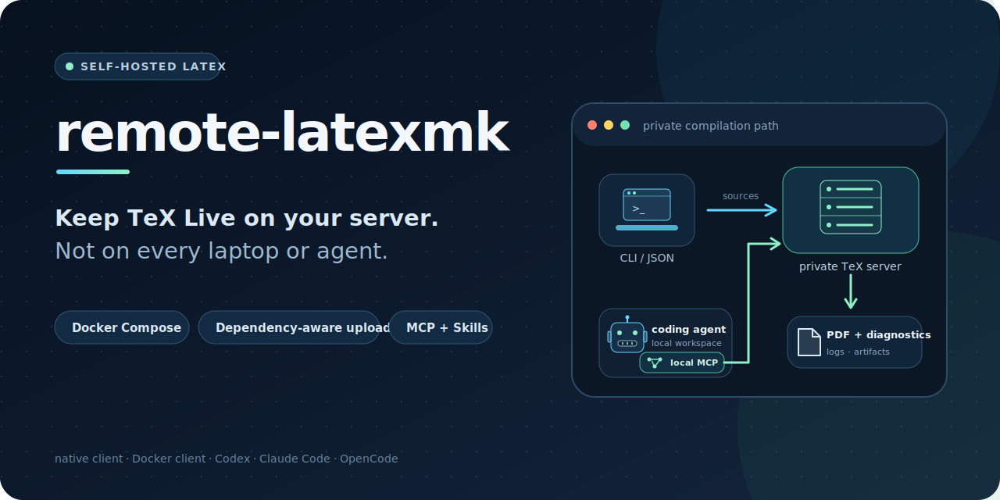

<p align="center">
  
</p>


**Compile on a private LaTeX server you control.** Connect from laptops,
containers, and coding agents through a native client, Docker, or MCP. Preview
dependency-aware uploads and receive PDFs, logs, and diagnostics without
installing TeX Live in each environment.

## Quick Start

The native server installer keeps both the service and TeX Live under
`~/.remote-latexmk`. It needs Linux on amd64 or arm64, but it does not need
Docker, Go, Node.js, pnpm, or a system-wide TeX installation.

```sh
VERSION=v0.3.0-rc.1
curl -fsSL \
  "https://github.com/InvisCat/remote-latexmk/releases/download/${VERSION}/install-server.sh" \
  | bash -s -- --version "${VERSION}" --profile full

~/.remote-latexmk/bin/remote-latexmkctl status
```

The fixed-version command becomes available when `v0.3.0-rc.1` is published.
Until then, use the source Compose path below. The installer defaults to
`127.0.0.1:8080`, generates a private token, verifies the downloaded server
archive, and does not use `sudo` or edit shell startup files. See
[Native server installation](docs/NATIVE_INSTALL.md) before changing the
listen address.

On a laptop or Agent machine with Node.js, use the npm client without local TeX
Live:

```sh
export LATEXMK_SERVER=http://your-private-server:8080
export LATEXMK_TOKEN_FILE=/absolute/path/to/latexmk-token

npx --yes --ignore-scripts remote-latexmk@0.3.0-rc.1 files main.tex
npx --yes --ignore-scripts remote-latexmk@0.3.0-rc.1 main.tex
```

When npm publishing is enabled for the tag, the `remote-latexmk` package is
published from the same tagged client archives. It uses npm platform packages
and has no install script that fetches or executes a binary from another URL.

### Docker Compose from source

Requirements: Git, Docker, Docker Compose, and `curl` for the health check. You
do not need local Go, Node.js, pnpm, Perl, latexmk, or TeX Live.

```sh
git clone https://github.com/InvisCat/remote-latexmk.git
cd remote-latexmk
cp .env.example .env

# Set LATEXMK_API_TOKEN in .env to a new random value of at least 24 characters.
# For example, `openssl rand -hex 32` prints a suitable value.

docker compose -f compose.yaml up -d --build server gateway
curl --fail --retry 30 --retry-all-errors --retry-delay 1 \
  http://127.0.0.1:8080/readyz

export LATEXMK_PROJECT_DIR="/absolute/path/to/your/paper"
docker compose -f compose.yaml run --rm --no-deps --build client main.tex
```

The final command compiles `$LATEXMK_PROJECT_DIR/main.tex` and writes the
returned artifacts into that paper directory. The client container contains
Git and CA certificates, but no TeX Live. The first build can take time because
it pulls a TeX Live base image; later builds and starts reuse Docker's cache.
After the first client build, omit `--build` for normal recompiles.

Preview the exact upload without contacting the server:

```sh
docker compose -f compose.yaml run --rm --no-deps client files main.tex
```

If the paper inherits ignore rules from a parent Git repository, set
`LATEXMK_PROJECT_DIR` to that Git root and pass the entry path relative to it,
for example `papers/my-paper/main.tex`.

The explicit `-f compose.yaml` selects the definitions that build the server
and Docker client from this checkout. The prebuilt release-image path is under
[Prebuilt images](#prebuilt-images-and-digest-pinning). The service binds to
`127.0.0.1:8080` by default; protect any non-local binding with a private
network, firewall, VPN, or TLS reverse proxy.

## Alternative client installations

The Quick Start already provides a complete Docker client. Nothing in this
section is required for that path. Install a native client only when you want
to compile without running the client container.

Choose either a release binary or a source build, then configure the client.

### Download a release binary

The [`v0.2.0-rc.1` prerelease](https://github.com/InvisCat/remote-latexmk/releases/tag/v0.2.0-rc.1)
provides client archives for Linux, macOS, and Windows on amd64 and arm64.
Verify downloads with the attached `SHA256SUMS`. See
[Publishing](docs/PUBLISHING.md) for the release process.

### Build the native client from source

Building the native client requires Go 1.23+. The resulting binary does not
need Go or TeX Live at runtime; it needs Git when Git-aware selection is active:

```sh
mkdir -p "$HOME/.local/bin"
go build -trimpath -o "$HOME/.local/bin/latexmk" \
  ./packages/cli/cmd/latexmk
export PATH="$HOME/.local/bin:$PATH"
latexmk version
```

Add `$HOME/.local/bin` to the shell's startup configuration if it is not
already on `PATH`. The client uses the operating-system CA store for normal
HTTPS.

### Configure the native client

Configure one paper and compile it against the Compose server:

```sh
cd /absolute/path/to/paper
latexmk init --server http://127.0.0.1:8080
export LATEXMK_TOKEN='the same token from the server .env'
latexmk cache ignore
latexmk files main.tex
latexmk main.tex
```

`latexmk cache ignore` is explicit. It appends `.latexmk-cache/` to the project
`.gitignore` only when needed. `git clean -fdX` deletes ignored cache files and
therefore resets the local project identity.

## AI agent setup

The npm package can install the client entry, both Skills, and one local MCP
entry in a single command. It detects installed Agent CLIs unless `--agent` is
given explicitly:

```sh
npx --yes --ignore-scripts remote-latexmk@0.3.0-rc.1 agent install \
  --project-root /absolute/path/to/paper \
  --server https://latex.example.edu \
  --token-file /absolute/path/to/latexmk-token
```

Pass `--dry-run` first to inspect the commands and destinations. The installer
does not accept a raw bearer token. It uses the native `codex mcp` and
`claude mcp` commands, and makes a structured, backed-up JSONC edit for
OpenCode. Existing changed Skills are not overwritten unless `--force` is
explicit. The maintenance Skill can propose destructive cleanup, but still
requires a preview and explicit confirmation before apply.

Until the npm package is published, install a tagged native client and use the
cross-Agent Skills installer:

```sh
npx skills add InvisCat/remote-latexmk -g \
  --skill remote-latex \
  --skill remote-latex-maintenance \
  --agent codex --agent claude-code --agent opencode
```

Manual user-level locations are:

| Agent | Skill directory |
|---|---|
| Codex | `~/.agents/skills/<skill-name>/SKILL.md` |
| Claude Code | `~/.claude/skills/<skill-name>/SKILL.md` |
| OpenCode | `~/.config/opencode/skills/<skill-name>/SKILL.md` or `~/.agents/skills/<skill-name>/SKILL.md` |

Codex and OpenCode can discover this repository's checked-in `.agents/skills`
directories directly. Claude Code needs its native directory, the installer,
or a future plugin wrapper.

### Local MCP server

The same client binary exposes strict STDIO MCP tools:

```sh
latexmk mcp serve --stdio --project-root /absolute/path/to/paper
```

For a Docker-based MCP host, first set `LATEXMK_PROJECT_DIR` in the repository
`.env` to the paper directory. The following command uses the local Compose
server and its client token settings:

```sh
docker compose --project-directory /absolute/path/to/remote-latexmk \
  -f /absolute/path/to/remote-latexmk/compose.yaml \
  run --rm -T client mcp serve --stdio --project-root /workspace
```

For an existing remote server, also set `LATEXMK_CLIENT_SERVER`,
`LATEXMK_CLIENT_TOKEN`, and any CA file in `.env`, then add `--no-deps` after
`run --rm` so Compose does not start its local server.

MCP fixes one project root at startup and exposes structured manifest, compile,
job, bounded log, diagnostic, artifact, and cleanup operations. It has no tool
for arbitrary shell commands, URLs, server paths, compiler argument lists, or
token reads. See [AI Agent integrations](docs/AI_AGENTS.md) and
[the MCP contract](docs/MCP.md).

## What gets uploaded?

The default `auto` mode starts from the entry file and discovers supported
literal LaTeX dependencies. Successful remote compiles add workspace-local
`.fls` input history, and a bounded missing-file retry can add an exact file
only after the client rechecks its current policy-filtered manifest.

Before any upload, the client applies:

- the selected project root, which defaults to the entry file's directory;
- Git's tracked, untracked, nested ignore, repository exclude, and global
  exclude rules;
- a non-overridable denylist for local configuration, `.env`, key material,
  client cache, and manifest-policy files;
- user exclusions and `.latexmkignore`;
- regular-file, project-boundary, size, and symlink checks.

Inspect the content-addressed manifest without contacting the server:

```sh
latexmk files main.tex
latexmk files --json main.tex
latexmk --dry-run main.tex
```

Static discovery cannot prove that every custom macro or package reference is
complete. Use an exact manifest for sensitive or dynamic projects; use
`--upload-mode all` only as an explicit compatibility fallback after reviewing
the manifest. See [Dependency discovery](docs/DEPENDENCIES.md).

## Engines and images

| Deployment | Default engines | Notes |
|---|---|---|
| Root source Compose | XeLaTeX, PDFLaTeX | Slim CJK-oriented TeX Live image |
| Full server image | XeLaTeX, LuaLaTeX, PDFLaTeX | Larger TeX Live image; LuaLaTeX runs with `--safer` and `--nosocket` |

When selecting a full GHCR image, set the matching released client image and
all three server policy values. Then use the base and GHCR Compose files shown
under [Prebuilt images](#prebuilt-images-and-digest-pinning):

```dotenv
LATEXMK_GHCR_SERVER_IMAGE=ghcr.io/inviscat/remote-latexmk-server-full:0.2.0-rc.1
LATEXMK_GHCR_CLIENT_IMAGE=ghcr.io/inviscat/remote-latexmk-client:0.2.0-rc.1
LATEXMK_IMAGE_PROFILE=texlive-full
LATEXMK_ENGINES=xelatex,lualatex,pdflatex
```

## Executable paper examples

The repository keeps two synthetic papers as both documentation and test
fixtures. [`examples/slim`](examples/slim) uses the standard `article` class
against the default slim image. [`examples/ieee`](examples/ieee) uses
`IEEEtran`, BibTeX, an external figure, and several common paper packages
against the full image. Both reveal in their acknowledgments that they are test
data, not real academic papers.

Run the complete Compose smoke flow without installing TeX Live locally:

```sh
make smoke-papers
```

The test previews the exact dependency manifests, compiles both papers with
PDFLaTeX, downloads their artifacts, checks result APIs, and renders the first
pages when Poppler is available. It uses isolated Compose projects and removes
only the temporary resources it creates.

## Common workflows

```sh
# Compile once or watch selected dependencies.
latexmk main.tex
latexmk watch main.tex

# Inspect server capabilities and local policy health.
latexmk meta
latexmk doctor

# Work with immutable queued jobs and bounded diagnostics.
latexmk compile --detach --json main.tex
latexmk jobs list --limit 50 --json
latexmk diagnostics JOB_ID --json
latexmk logs JOB_ID --tail 200 --max-bytes 65536 --json
latexmk artifacts list JOB_ID --json
```

Local and remote deletion are preview-first:

```sh
latexmk cache inspect --project-root . --json
latexmk cache clean --project-root . --scope local-generated --json
latexmk remote clean --scope results
latexmk remote clean --plan-id PLAN_ID --yes
```

Both cleanup paths return a ten-minute plan ID. Remote apply accepts only that
plan ID, not a repeated scope. The server rejects the apply before deletion if
the remote report changed since preview. A successful apply consumes the plan.
Active jobs and shared content-addressed blobs remain protected. See
[Agent-facing CLI](docs/AGENT_CLI.md) for the JSON compatibility boundary and
full plan lifecycle.

## Private HTTPS

The optional Compose HTTPS profile runs Caddy with a private local CA:

```sh
docker compose --profile https up -d proxy
docker compose cp proxy:/data/caddy/pki/authorities/local/root.crt \
  certs/caddy-local-root.crt
```

Distribute only the copied root certificate, never the CA private key. Native
clients can use `LATEXMK_CA_FILE`; the Compose client can mount the copied
certificate. See [Operations](docs/OPERATIONS.md) for LAN, VPN, trusted
certificate, resource, retention, and network guidance.

## Security boundary

- Shell escape is disabled by default and `latexmk -norc` ignores rc files.
- Every compile uses a fresh temporary workspace and a restricted environment.
- Queued jobs bind to immutable content-addressed source snapshots.
- The root Compose server has no normal Internet route; a credential-free
  gateway publishes the localhost port.
- Uploads, expanded files, logs, artifacts, jobs, processes, and retained state
  have limits.

Uploaded snapshots and results are retained until configured expiry or explicit
cleanup. There is no shared mutable editing workspace, but this is still
persistent remote storage.

TeX remains a programmable and complex input format. The current server and TeX
process share one container identity. Do not run this as an anonymous compiler
for hostile documents without a separate worker sandbox or stronger runtime
isolation. Read [Security](docs/SECURITY.md) before exposing the service.

## Prebuilt images and digest pinning

The current public release candidate is
[`v0.2.0-rc.1`](https://github.com/InvisCat/remote-latexmk/releases/tag/v0.2.0-rc.1).
The copied `.env` selects the release pinned in `compose.ghcr.yaml` for bare
`docker compose` commands. The commands below list both files explicitly. To
select an exact version, set:

```dotenv
LATEXMK_GHCR_NAMESPACE=inviscat
LATEXMK_GHCR_VERSION=0.2.0-rc.1
```

```sh
export LATEXMK_PROJECT_DIR="/absolute/path/to/your/paper"
docker compose -f compose.yaml -f compose.ghcr.yaml up -d
docker compose -f compose.yaml -f compose.ghcr.yaml \
  run --rm --no-deps client main.tex
```

For immutable deployment pins, use full `@sha256:` references instead of
putting a digest in `LATEXMK_GHCR_VERSION`:

```dotenv
LATEXMK_GHCR_SERVER_IMAGE=ghcr.io/inviscat/remote-latexmk-server@sha256:SERVER_DIGEST
LATEXMK_GHCR_CLIENT_IMAGE=ghcr.io/inviscat/remote-latexmk-client@sha256:CLIENT_DIGEST
```

To use only the Docker client with an existing server, set
`LATEXMK_CLIENT_SERVER`, `LATEXMK_CLIENT_TOKEN`, and any required
`LATEXMK_CLIENT_CA_FILE` in `.env`, keep `LATEXMK_PROJECT_DIR` set to the paper,
and run:

```sh
docker compose -f compose.yaml -f compose.ghcr.yaml \
  run --rm --no-deps client main.tex
```

The release workflow currently builds server images for `linux/amd64`, a
client image for `linux/amd64` and `linux/arm64`, and native client archives for
Linux, macOS, and Windows on amd64 and arm64. Starting with the next tagged
release, it also builds native Linux server archives and the versioned server
installer. npm publication is separately gated until trusted publishing is
configured.

## Documentation

- [Architecture and design choices](docs/ARCHITECTURE.md)
- [AI Agent integrations and discovery](docs/AI_AGENTS.md)
- [Dependency discovery and upload policy](docs/DEPENDENCIES.md)
- [MCP tools](docs/MCP.md)
- [Agent-facing CLI and JSON contracts](docs/AGENT_CLI.md)
- [HTTP API](docs/API.md)
- [Operations and HTTPS](docs/OPERATIONS.md)
- [Native server installation](docs/NATIVE_INSTALL.md)
- [Security model](docs/SECURITY.md)
- [Publishing, repository metadata, and social preview](docs/PUBLISHING.md)
- [Advanced PaaS bundler](packages/deploy/README.md)

## Development

Requirements: Go 1.23+, Node.js 22+, and pnpm 11. Local end-to-end tests also
need a TeX engine and the upstream Perl latexmk tool.

```sh
corepack enable pnpm
pnpm install --frozen-lockfile
pnpm test
pnpm lint
pnpm build
```

The repository contains the Go client and server, an optional development
Dashboard, deployment generators, and Agent integrations. The Dashboard is not
embedded in the server and is not started by the default Compose quick start.
Implementation details and selection reasons live in
[Architecture](docs/ARCHITECTURE.md).

## License

[MIT](LICENSE)
