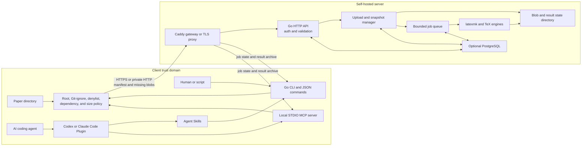
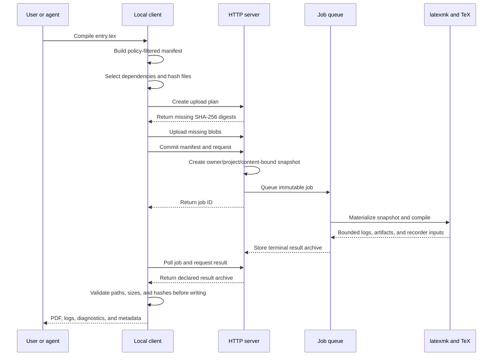
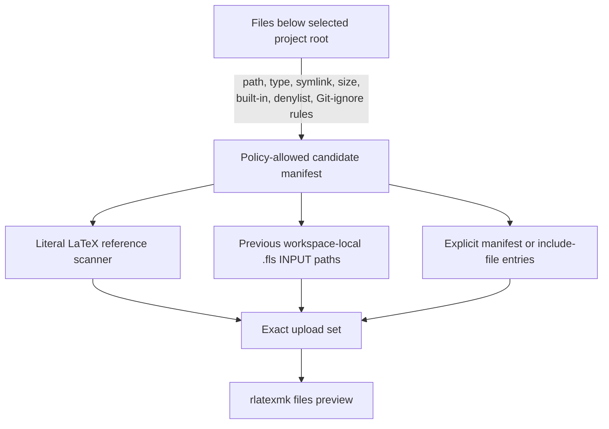
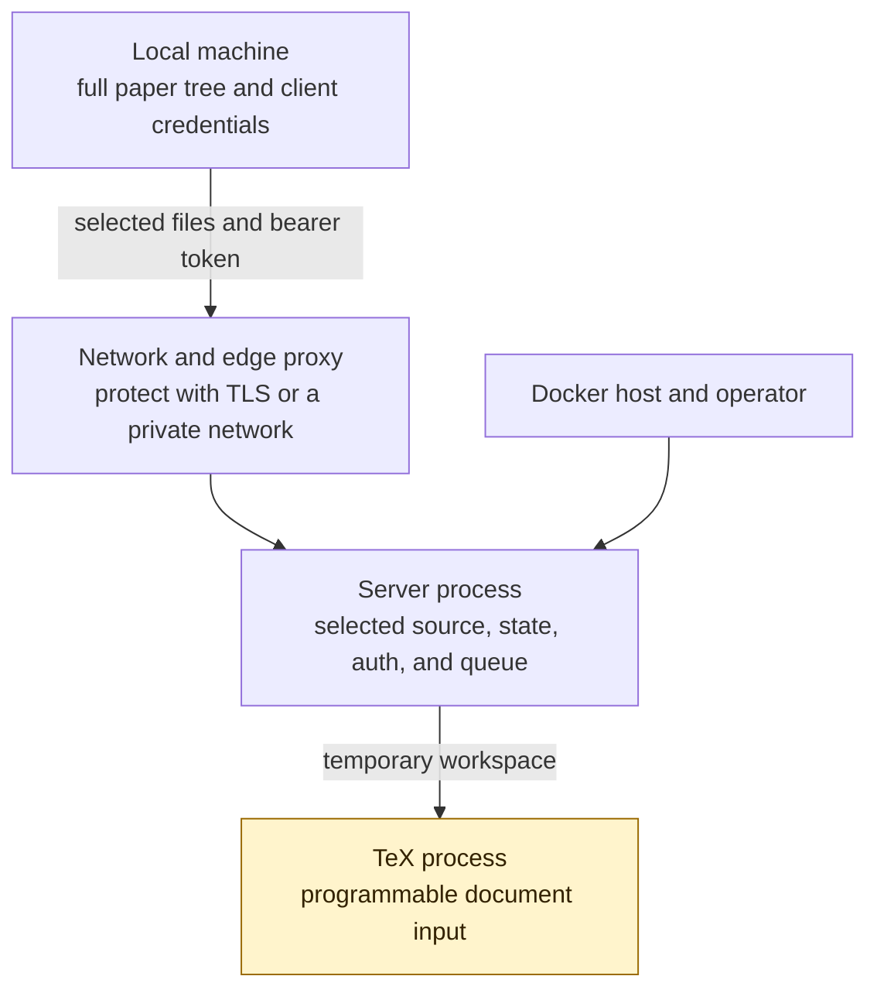

# Architecture

remote-latexmk is a self-hosted remote LaTeX compilation system. A small Go
client selects the local files needed by a paper, sends them to a Go server,
and downloads the resulting PDF, logs, SyncTeX data, and allowed auxiliary
files. TeX Live and the upstream `latexmk` program run on the server. They are
not required on a native or containerized client.

This document describes the current implementation. It does not describe the
unrelated upstream Perl LatexMk distribution.

## Design goals reflected in the code

- Keep the large TeX Live installation on one controlled server.
- Upload an inspectable dependency set instead of the whole paper repository by
  default.
- Bind every queued job to immutable source content.
- Offer the same policy through an interactive CLI, a JSON CLI, and a local
  STDIO MCP server.
- Bound uploads, logs, artifacts, queues, execution time, and retained state.
- Reduce common TeX risks without claiming that TeX is a high-assurance
  sandbox.

## Why these implementation choices

- A centralized TeX Live image removes the largest runtime dependency from
  laptops, CI jobs, editor containers, and agent environments. It also gives
  those clients one server-controlled toolchain profile.
- Go is used for the client and server so the native client can be distributed
  as one small runtime binary and the server can enforce the same typed request
  model without accepting a shell command line.
- Content-addressed incremental upload avoids retransmitting unchanged files.
  An owner/project/content-derived snapshot also gives the queue a stable input
  that later uploads cannot mutate.
- Dependency and confidentiality policy run on the client, before network
  access. The server sees only the selected manifest and cannot browse the
  client's paper directory.
- A bounded asynchronous queue separates upload from expensive TeX execution,
  makes concurrency limits explicit, and gives humans and agents a stable job
  interface for polling, logs, cancellation, and artifact download.
- MCP runs locally inside the client process. This keeps filesystem selection,
  CA files, and bearer credentials on the client side and lets one process bind
  its tools to one resolved paper root. Plugin mode obtains that root from the
  Agent host instead of storing an absolute paper path in the Plugin.
- PostgreSQL is optional because a single static-token deployment does not need
  user administration. It becomes the persistent identity and job store when
  deployments need separate principals or restart-stable records.
- The public edge is a small Caddy service rather than the TeX container. The
  default topology can therefore keep the compiler and state volume on an
  internal Docker network.

## Components

### Client

`packages/cli` builds one Go binary named `rlatexmk`. It contains no TeX
distribution. Its main responsibilities are:

- resolve the project root and entry file;
- build the policy-allowed local manifest;
- apply Git ignore rules, built-in exclusions, user exclusions, and the
  denylist;
- discover common literal LaTeX dependencies;
- merge approved explicit files and safe recorder history;
- upload only content the server does not already have for the authenticated
  owner;
- poll jobs, inspect bounded logs and diagnostics, and download declared
  artifacts safely;
- watch the selected dependency and policy files for continuous compilation;
- expose strict JSON commands and a project-root-bound STDIO MCP server.

The Codex and Claude Code Plugin starts MCP in roots-first mode. MCP accepts one
canonical local root from a capable host; when roots are not advertised, the
Plugin uses the task workspace inherited as the MCP process working directory.
It does not search above that boundary for project configuration. User-level
server, credential, CA, and TLS verification settings cannot be replaced by
project configuration in this mode.

The default project root is the entry file's directory. A parent Git root is
used only when the user selects that root mode or supplies a project root. This
keeps a command in a paper subdirectory from silently selecting its parent
repository.

The native client needs Git when effective Git-ignore discovery is enabled. It
does not need Go, Node.js, pnpm, TeX Live, or the upstream `latexmk` program at
runtime. The client container adds Git and CA certificates, but still contains
no TeX Live.

### npm launcher

`packages/npm-cli` is a small Node.js launcher around the same Go client. npm
selects one of six OS/architecture packages through `optionalDependencies`.
The launcher forwards normal CLI and MCP arguments to that native binary; it
does not reimplement dependency discovery, upload policy, archive handling, or
the HTTP protocol in JavaScript.

The public client command is `rlatexmk`, so a global npm install does not
replace the unrelated Perl `latexmk` program. The npm package and Plugin use
the same native command through their versioned launcher.

The repository also contains one Plugin directory shared by the Codex and
Claude Code marketplace manifests. It bundles the npm-backed MCP command and
generated copies of the client setup, server operation, compile, and
maintenance Skills. An interactive `auth login` command reads the token with
terminal echo disabled, verifies the service and token through read-only
endpoints, writes it to a private client file, and stores only that file path
and the server URL in user configuration. The client setup Skill can instead
preview and record an existing token-file path; it never reads or stores the
token value.

The older Agent installer remains for OpenCode and custom fixed-root setups. It
binds MCP to one resolved project root, accepts credentials only by token-file
path, and installs complete Skill directories. OpenCode JSONC is updated
structurally with the previous file backed up. Existing changed Skills require
an explicit `--force` replacement.

### Server

`packages/server` is a Go HTTP service. It uses Gin for routing, a bounded job
manager for queued compilation, and GORM with pgx when PostgreSQL is configured.
It supports:

- a static bearer-token mode for a single trusted principal;
- PostgreSQL-backed users and token hashes for separate principals;
- an explicitly unauthenticated mode for isolated development only;
- an opt-in legacy synchronous archive endpoint for pre-v2 clients;
- the current incremental upload and queued-job protocol;
- result retention and explicit cleanup;
- public health, readiness, capability, build, and toolchain metadata.

The server constructs `latexmk` arguments from validated request fields. It
does not accept an arbitrary shell command or compiler argument array.

### Compiler runner

Each compile uses a fresh temporary working directory. A queued compile first
materializes its immutable snapshot into that directory. The runner starts the
upstream `latexmk` executable directly, not through a shell. It uses `-norc`,
enables the TeX recorder, disables shell escape by default, and supplies a
small environment rather than inheriting the server process environment.
LuaLaTeX also receives `--safer` and `--nosocket`.

The runner caps stdout and stderr, applies a timeout, kills the process group on
Unix when needed, and collects only regular files that pass the artifact
allowlist and workspace-path checks. Recorder paths outside the workspace are
discarded.

The compile process runs inside the same server container and operating-system
namespace as the API. A fresh directory, a private HOME/TEXMF layout, and TeX
file policies reduce exposure. The root Compose deployment also supplies a
read-only container root and resource limits. These controls do not form a
high-assurance hostile-code sandbox. There is no per-job container, microVM, or
kernel isolation layer in the current implementation.

### Persistent state and database

The server state directory contains owner-scoped content-addressed source blobs
and result archives. A state sweeper applies independent result, snapshot, and
orphaned-blob retention periods while protecting active uploads and jobs.
Terminal job metadata expires with its result archive retention period.

Job state changes use conditional transitions, so a successful cancellation
cannot be overwritten by a worker that previously read the queued record. The
current scheduler is still single-instance; it does not implement cross-process
leases or shared object storage.

With `DATABASE_URL` configured, PostgreSQL stores users, token hashes, project
snapshots, and job records. The same PostgreSQL protocol is used with the
PGlite socket adapter, but PGlite is intended only for development, demos, or
tests.

Without `DATABASE_URL`, current snapshot and job metadata are held in process
memory. Source blobs and result archives can still live in the state volume,
but a server restart loses the in-memory catalog needed to address those old
records. The default root Compose file uses this simple static-token mode.

### Gateway and HTTPS

The root Compose deployment places the token/state/TeX server only on an
internal Docker network. A separate Caddy gateway publishes the HTTP port. The
gateway has no state volume or configured API token, although proxied HTTP
headers and request bodies pass through it.

The optional `https` profile starts another Caddy service with a private local
CA. Its CA private key remains in a Docker volume; clients receive only the
exported root certificate. Both HTTP and HTTPS bind to localhost by default.
Listening on a LAN requires an explicit bind-address change and an appropriate
private network, firewall, VPN, or other access boundary.

### Dashboard

`packages/dashboard` is a separate Preact/Vite administration console for
jobs, capabilities, users, and API tokens. It calls the same HTTP API and keeps
the operator token in browser local storage.

The Dashboard is not a service in the root `compose.yaml` and is not part of
the default one-command server deployment. It currently has its own development
server and must be built and hosted separately when used.

### Deployment bundler

`packages/deploy` is a TypeScript tool that generates a standalone Docker build
context, deployment metadata, and Compose configuration for selected image,
authentication, database, and resource profiles. It is useful for PaaS or
deployment systems that need a small independent build context. The root
`compose.yaml` remains the direct self-hosted path.

### Native server installer

`scripts/install-server.sh` installs a tagged Linux server archive and a
private TeX Live tree under `~/.remote-latexmk`. It verifies the release
archive checksum, defaults to localhost and token authentication, and creates
a systemd user service when available. That unit hides the rest of the user's
home directory and exposes only the release, TeX Live, state, and temporary
paths. A weaker PID-file fallback requires explicit selection when no user
manager is available. The installer does not use root privileges or modify
shell startup files. The installed TeX Live package profile and the engines
accepted by the server are separate settings. The full package profile keeps
LuaLaTeX disabled by default unless it is explicitly selected.

`scripts/remote-latexmkctl` owns start, stop, status, logs, explicit token
display, tagged upgrades, and confirmation-based removal. Normal uninstall
retains configuration, TeX Live, logs, and state. Purge is a separate explicit
operation guarded by an installation marker.

## Queued compile flow

The upload protocol is content-addressed. A plan lists project-relative paths,
sizes, and SHA-256 values. The server asks only for blobs absent for that
authenticated owner. Committing a plan creates a snapshot ID derived from the
owner, project ID, and canonical file manifest. Later uploads to the same
project cannot change an already queued job.

On a failed compile, a capable server can return conservative normalized
missing-file requests. The client accepts a requested path only if it already
exists in the current local policy-filtered manifest. Automatic retries are
bounded, and every retry creates a new snapshot and job.

## Dependency selection

Policy filtering happens before dependency discovery. The scanner therefore
cannot restore or inspect a file removed by Git ignore, the denylist, the
project-root boundary, or symlink checks. Recorder history also has to pass the
current manifest policy again.

`auto` is the default upload mode. `manifest` selects the entry and explicit
files. `all` selects all policy-allowed candidates and is an explicit
compatibility fallback; it does not bypass upload policy. Static discovery is
not a full TeX interpreter, so users should inspect `rlatexmk files` for a
sensitive paper.

## Authentication and ownership

Bearer authentication creates a principal before access to upload, project,
job, result, cleanup, and administration operations. Blobs and snapshot IDs are
scoped by that principal.

In static-token mode, every holder of the same token is the same administrator
principal. Project IDs separate papers for organization and cleanup, but they
do not create separate users inside that token. PostgreSQL mode is required
when separate user principals and roles are needed.

Database tokens are stored as SHA-256 hashes and returned in plaintext only at
creation. The bootstrap token and static token are deployment secrets and are
not stored in a paper manifest or returned by metadata endpoints.

## Agent interfaces

The repository provides four Agent Skills:

- `remote-latex` for manifest inspection, compilation, diagnostics, logs, and
  artifact download;
- `remote-latex-maintenance` for previewed local or remote cleanup;
- `remote-latex-server` for server deployment, operation, networking, TLS, and
  server-side troubleshooting;
- `remote-latex-setup` for client login, CA configuration, and connection
  troubleshooting.

Skills contain workflow instructions. They do not install the client or create
a network connection by themselves. The separate npm Agent installer can copy
the Skills and register an npm-backed local MCP command.

The local STDIO MCP server exposes strict tools for manifests, jobs, bounded
logs, diagnostics, artifacts, compile start, cancellation, and two-phase
cleanup. It resolves one project root at startup. Tool calls cannot replace the
root, provide an arbitrary server URL, pass a command line, or return the API
token.

Remote cleanup is two-phase in both MCP and the ordinary CLI. Preview binds the
server, token-owned project, scope, and server-issued report digest to a
short-lived local plan without storing credentials. Apply sends the bound
digest, and the server recomputes and compares it under the same admission lock
used for deletion. A changed report is rejected before any target is removed.

The JSON CLI covers the same core workflow for agents without MCP. Structured
diagnostics are a bounded index into stdout, stderr, and compiler logs. Raw logs
remain the source of truth and are available as a bounded fallback.

## Trust boundaries and current limitations

- The server operator and Docker host can access uploaded sources and stored
  results. This is a self-hosted confidentiality boundary, not end-to-end
  encryption from the operator.
- TeX input is programmable. Disabled shell escape, `-norc`, file policies,
  reduced environment, container hardening, and resource limits reduce risk but
  do not make anonymous hostile uploads safe.
- The root Compose topology restricts server egress with an internal Docker
  network. Other deployments must reproduce that boundary explicitly.
- Stored blobs, snapshots, jobs, and results are not a remote editable
  workspace, but they remain server-side until cleanup or retention removes
  them.
- The client protects files only within the selected local policy. Users should
  inspect the manifest and keep secrets outside the project root or deny them.
- The current root Compose deployment does not include the Dashboard or a
  PostgreSQL service.
- A version-changing Release PR creates versioned images, archives, checksums,
  attestations, and required npm packages after merge. Branch CI validates the
  source implementation without publishing external artifacts.

See [SECURITY.md](SECURITY.md) for the operational threat model,
[DEPENDENCIES.md](DEPENDENCIES.md) for discovery details, [API.md](API.md) for
the wire protocol, and [OPERATIONS.md](OPERATIONS.md) for deployment limits.
